# Spring Boot Blog System
이 프로젝트는 Spring Boot를 사용한 기본적인 블로그입니다.
사용자 인증, 게시물 관리 등의 기능을 제공합니다.

## 기능 구성

### 1. 사용자 관리
- 회원가입
- 로그인/로그아웃
- Spring Security를 통한 인증 처리

### 2. 게시물 관리
- 게시물 목록 조회
- 게시물 상세 조회
- 게시물 작성
- 게시물 수정
- 게시물 삭제

## 시스템 아키텍처

### 전체 시스템 구조

```mermaid
flowchart TB
    subgraph Authentication
        User1[User] --> LoginPage[Login Page]
        User1 --> SignupPage[Signup Page]
        SignupPage --> |POST /user| UserController[UserApiController]
        UserController --> |save| UserSvc[UserService]
        UserSvc --> |save| UserDB[(User DB)]
        LoginPage --> |POST /login| Security[Spring Security]
        Security --> |authenticate| UserDetailSvc[UserDetailService]
        UserDetailSvc --> UserDB
    end

    subgraph BlogManagement
        User2[User] --> |GET /articles| BlogView[BlogViewController]
        User2 --> |GET /new-article| NewArticle[New Article Page]
        NewArticle --> |POST /api/articles| BlogApi[BlogApiController]
        BlogApi --> |save| BlogSvc[BlogService]
        BlogSvc --> |save| ArticleDB[(Article DB)]
        
        User2 --> |GET /articles/id| ArticleView[Article View]
        ArticleView --> |PUT /api/articles/id| UpdateArticle[Update Article]
        ArticleView --> |DELETE /api/articles/id| DeleteArticle[Delete Article]
        
        BlogView --> |findAll| BlogSvc
        UpdateArticle --> BlogSvc
        DeleteArticle --> BlogSvc
    end

    subgraph SecurityConfig
        WebSecurity[WebSecurityConfig] --> |configure| FilterChain[Security Filter Chain]
        WebSecurity --> |setup| AuthManager[Authentication Manager]
        WebSecurity --> |setup| PwEncoder[Password Encoder]
    end
```


## 주요 컴포넌트

### Controllers
- `BlogViewController`: 페이지 렌더링 담당
- `BlogApiController`: REST API 엔드포인트 제공
- `UserApiController`: 사용자 관리 API 제공

### Services
- `BlogService`: 게시물 관련 비즈니스 로직
- `UserService`: 사용자 관리 비즈니스 로직
- `UserDetailService`: Spring Security 인증 처리

### Repositories
- `BlogRepository`: 게시물 데이터 관리
- `UserRepository`: 사용자 데이터 관리

## API 엔드포인트

### 블로그 게시물 관련
- `GET /articles`: 게시물 목록 페이지
- `GET /articles/{id}`: 게시물 상세 페이지
- `GET /new-article`: 게시물 작성 페이지
- `POST /api/articles`: 게시물 생성
- `PUT /api/articles/{id}`: 게시물 수정
- `DELETE /api/articles/{id}`: 게시물 삭제

### 사용자 관리 관련
- `GET /login`: 로그인 페이지
- `GET /signup`: 회원가입 페이지
- `POST /user`: 회원가입 처리
- `GET /logout`: 로그아웃 처리

## 기술 스택
- Spring Boot
- Spring Security
- Spring Data JPA
- Thymeleaf
- H2 Database
- Bootstrap
- JavaScript (Fetch API)

## 보안 기능
- BCrypt 비밀번호 암호화
- Spring Security 기반 인증
- 세션 관리

## 프로젝트 구조
```
src/
├── main/
│   ├── java/
│   │   └── com/adam9e96/BlogStudy/
│   │       ├── config/
│   │       ├── controller/
│   │       ├── domain/
│   │       ├── dto/
│   │       ├── repository/
│   │       └── service/
│   └── resources/
│       ├── static/
│       │   └── js/
│       └── templates/
└── test/
```