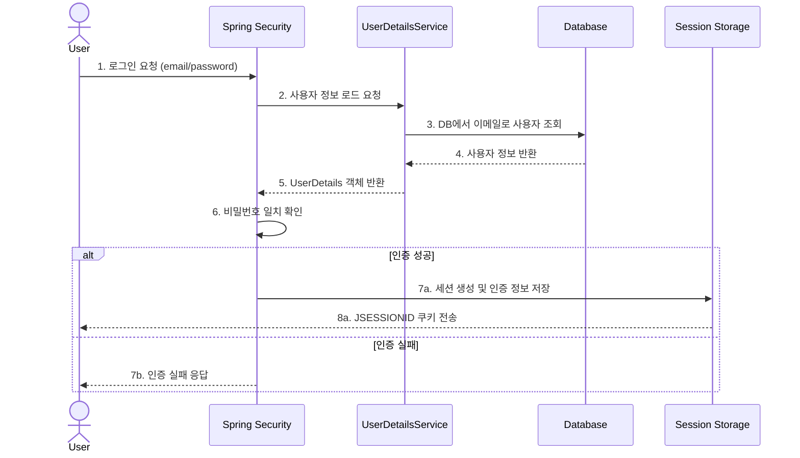
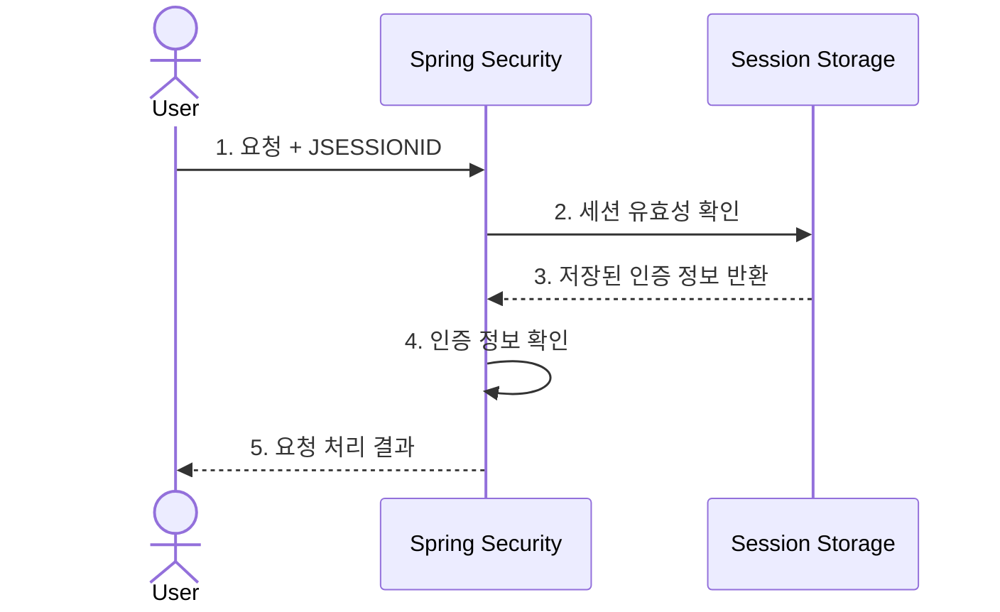
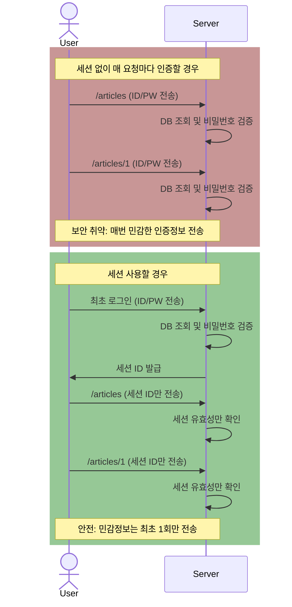
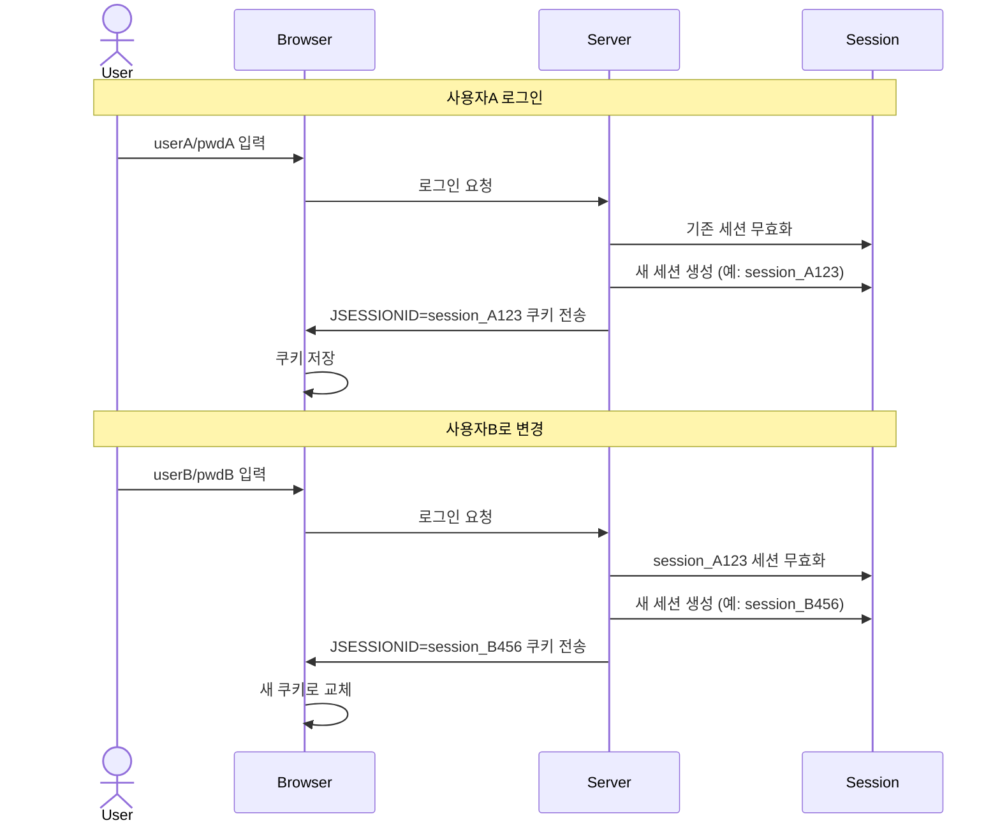

# Spring Boot Blog System

이 프로젝트는 Spring Boot를 사용한 기본적인 블로그입니다.
사용자 인증, 게시물 관리 등의 기능을 제공합니다.

## 기능 구성

### 1. 사용자 관리

- 회원가입
- 로그인/로그아웃(세션 기반 인증)
- Spring Security를 통한 인증 처리

### 2. 게시물 관리

- 게시물 목록 조회
- 게시물 상세 조회
- 게시물 작성
- 게시물 수정
- 게시물 삭제

## 시스템 아키텍처

### 전체 시스템 구조

```mermaid
flowchart TB
    subgraph Authentication
        User1[User] --> LoginPage[Login Page]
        User1 --> SignupPage[Signup Page]
        SignupPage -->|POST /user| UserController[UserApiController]
        UserController -->|save| UserSvc[UserService]
        UserSvc -->|save| UserDB[(User DB)]
        LoginPage -->|POST /login| Security[Spring Security]
        Security -->|authenticate| UserDetailSvc[UserDetailService]
        UserDetailSvc --> UserDB
    end

    subgraph BlogManagement
        User2[User] -->|GET /articles| BlogView[BlogViewController]
        User2 -->|GET /new - article| NewArticle[New Article Page]
        NewArticle -->|POST /api/articles| BlogApi[BlogApiController]
        BlogApi -->|save| BlogSvc[BlogService]
        BlogSvc -->|save| ArticleDB[(Article DB)]
        User2 -->|GET /articles/id| ArticleView[Article View]
        ArticleView -->|PUT /api/articles/id| UpdateArticle[Update Article]
        ArticleView -->|DELETE /api/articles/id| DeleteArticle[Delete Article]
        BlogView -->|findAll| BlogSvc
        UpdateArticle --> BlogSvc
        DeleteArticle --> BlogSvc
    end

    subgraph SecurityConfig
        WebSecurity[WebSecurityConfig] -->|configure| FilterChain[Security Filter Chain]
        WebSecurity -->|setup| AuthManager[Authentication Manager]
        WebSecurity -->|setup| PwEncoder[Password Encoder]
    end
```

## 주요 컴포넌트

### Controllers

- `BlogViewController`: 페이지 렌더링 담당
- `BlogApiController`: REST API 엔드포인트 제공
- `UserApiController`: 사용자 관리 API 제공

### Services

- `BlogService`: 게시물 관련 비즈니스 로직
- `UserService`: 사용자 관리 비즈니스 로직
- `UserDetailService`: Spring Security 인증 처리

### Repositories

- `BlogRepository`: 게시물 데이터 관리
- `UserRepository`: 사용자 데이터 관리

## API 엔드포인트

### 블로그 게시물 관련

- `GET /articles`: 게시물 목록 페이지
- `GET /articles/{id}`: 게시물 상세 페이지
- `GET /new-article`: 게시물 작성 페이지
- `POST /api/articles`: 게시물 생성
- `PUT /api/articles/{id}`: 게시물 수정
- `DELETE /api/articles/{id}`: 게시물 삭제

### 사용자 관리 관련

- `GET /login`: 로그인 페이지
- `GET /signup`: 회원가입 페이지
- `POST /user`: 회원가입 처리
- `GET /logout`: 로그아웃 처리

## 기술 스택

- Spring Boot
- Spring Security
- Spring Data JPA
- Thymeleaf
- H2 Database
- Bootstrap
- JavaScript (Fetch API)

## 보안 기능

- BCrypt 비밀번호 암호화
- Spring Security 기반 인증
- 세션 관리

---
## 세션 기반 인증 과정
### 로그인 성공 및 실패시

최초 로그인 시:
- 사용자 정보를 DB에서 조회하고 UserDetails 객체를 생성
- UserDetails 객체를 Security에 전달하여 인증 처리(폼 요청 데이터 비밀번호와 UserDetails 객체의 비밀번호 비교)
- 인증 성공 시 세션을 생성하고 정보를 쿠키에 저장

### 로그인 이후 처리(로그아웃 하지않고 이용)

로그인 이후 요청 시:
- JSESSIONID 쿠키를 통해 저장된 세션 확인
- 세션에 저장된 인정 정보 사용
- DB 조회없이 인증 상태 확인 가능

즉, 세션은 "이미 인증된 사용자임을 증명하는 수단"으로 사용되며, 초기 로그인 시의 인증은 대체하지않습니다.

### 만약 세션및 쿠키, 토큰등을 모두 사용하지 않는 경우
- 매 요청 마다 DB조회와 비밀번호 검증이 필요
- 민감한 정보(ID/PW)를 매번 전송해야함
- DB 조회 및 비밀번호 검증으로 인한 부하 발생
- 로그아웃 기능 구현이 어려움

### 새로운 계정으로 로그인 시 (세션변경이 일어남)
이 과정에서 이전 세션은 무효화되고 새로운 세션이 생성됩니다.
브라우저의 JSESSIONID 쿠키도 변경됩니다.
